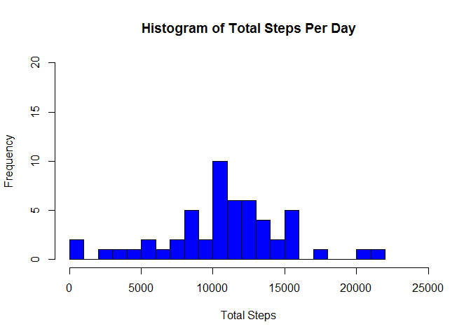
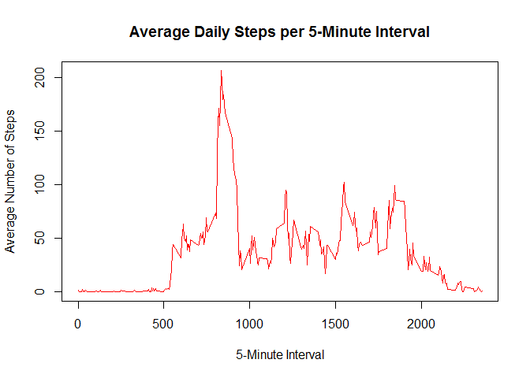
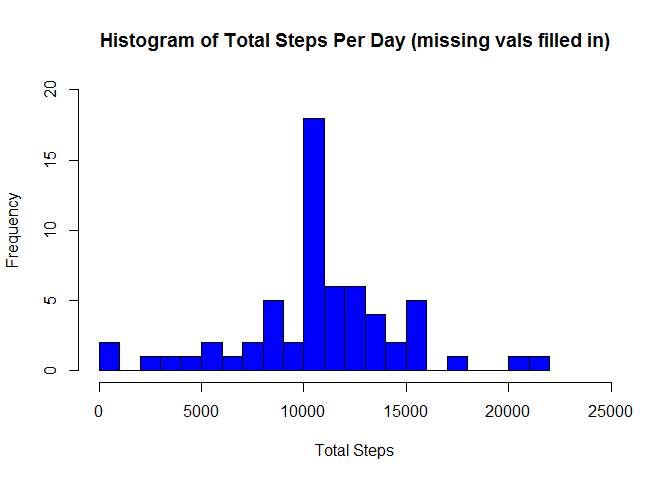
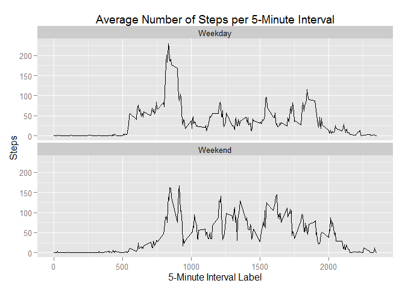

# Reproducible Research: Peer Assessment 1

## Loading and preprocessing the data


```r
options(scipen = 1, digits = 3)
library(utils)
library(ggplot2)
setwd("~/R")
```


```r
## Read in data file if not already present
fileDataDir <- "./act_mon/"
fileDataDirShort <- "./act_mon"
fileData <- "activity.csv"
fileDataPath <- paste(fileDataDir, fileData, sep = "")
fileZipPath <- paste(fileDataDir, "actvity.zip", sep = "")
urlActMonData <- "https://d396qusza40orc.cloudfront.net/repdata%2Fdata%2Factivity.zip"

if (!file.exists(fileDataPath)) {
    download.file(urlActMonData, fileZipPath, mode = "wb")
    if (file.exists(fileZipPath)) {
        unzip(fileZipPath, fileData, junkpaths = T, exdir = fileDataDirShort)
        file.remove(fileZipPath)
    }
}

## Read dataset into dataframe
dfActMon <- read.csv(fileDataPath)
```

## What is mean total number of steps taken per day?


```r
## Aggregate steps by day
dfTot <- aggregate(steps ~ date, sum, data = dfActMon)

## Calc average and median total steps per day
vMean = mean(dfTot$steps, na.rm = T)
vMedian = median(dfTot$steps, na.rm = T)

hist(dfTot$steps, main = "Histogram of Total Steps Per Day", xlab = "Total Steps", breaks = 25, col = "blue", xlim = c(0, 25000), 
     ylim = c(0, 20))
```

 

Mean number of total steps per day: 10766.189  
Median number of total steps per day: 10765  

## What is the average daily activity pattern?


```r
## Compute average number of steps per 5-minute interval
dfMean <- aggregate(steps ~ interval, mean, data = dfActMon)

plot(dfMean$interval, dfMean$steps, type = "l", 
     main = "Average Daily Steps per 5-Minute Interval",
     xlab = "5-Minute Interval", ylab = "Average Number of Steps",
     col = "red")
```

 

```r
## Sort the average number of steps in decreasing order
dfOrderedMean <- dfMean[order(dfMean$steps, decreasing = T), ]
vMaxSteps <- dfOrderedMean[1, "steps"]
vMaxStepInterval <- dfOrderedMean[1, "interval"]
```

The 5 minute interval labeled 835 contains the max number of average daily steps across all 5-minute intervals, 206.17.  

## Imputing missing values


```r
## Create a copy of the original dataset ordered by date and interval
dfActMonNoNAs <- dfActMon[order(dfActMon$date, dfActMon$interval), ] 

## Create another copy, merging in the 5-minute interval mean step
## values
dfActMonMeanMerge <- merge(dfActMonNoNAs, dfMean, by = "interval")

## Order by date and interval
dfActMonMeanMerge <- dfActMonMeanMerge[order(dfActMonMeanMerge$date, dfActMonMeanMerge$interval), ]

## Create a logical vector indicating the missing step values
lvNAs <- is.na(dfActMonNoNAs$steps)

## Count the missing values
vNACount <- sum(lvNAs) 

## Set missing step values to the average for the corresponding
## 5-minute interval
dfActMonNoNAs[lvNAs, "steps"] <- dfActMonMeanMerge[lvNAs, "steps.y"]

## Now aggregate steps by day
dfTot2 <- aggregate(steps ~ date, sum, data = dfActMonNoNAs)
```

Count of NA step values: 2304  


```r
## Calc average and median total steps per day
vMean2 = mean(dfTot2$steps)
vMedian2 = median(dfTot2$steps)

hist(dfTot2$steps, main = "Histogram of Total Steps Per Day (missing vals filled in)", xlab = "Total Steps", breaks = 25, col = "blue",
     xlim = c(0, 25000), ylim = c(0, 20))
```

 

Mean numbrer of total steps per day (no missing values): 10766.189  
Median number of total steps per day (no missing values): 10766.189  

Mean number of total steps per day(with missing values): 10766.189  
Median number of total steps per day (with missing values): 10765

Thus, the mean total steps per day values are the same after imputing missing values, and the median total steps per day values are slightly different.  

After imputing missing values, however, the total number of steps per day histogram DOES show a greater frequency of days where the total number of steps is in the 10,000 - 11,000 range.

## Are there differences in activity patterns between weekdays and weekends?


```r
## Add weekday/weekend factor to dfActMonNoNAs
dfActMonNoNAs$dowclass <- factor(x = as.character(as.numeric(weekdays(strptime(x = dfActMonNoNAs$date, format = "%Y-%m-%d"), abbreviate = FALSE) %in% c("Monday", "Tuesday", "Wednesday", "Thursday", "Friday"))), levels = c("1", "0"),  labels = c("Weekday", "Weekend"), ordered = TRUE)

## Compute 5-minute interval step means across 1) weekdays and 
## 2) weekend days
dfMeanWkdayWkend <- aggregate(steps ~ dowclass + interval, mean, data = dfActMonNoNAs)

## Graph panel line plot depicting average steps per 5 minute
## interval across 1) weekdays and 2) weekend days
ggplot(data = dfMeanWkdayWkend) + labs(title = "Average Number of Steps per 5-Minute Interval", x = "5-Minute Interval Label", y = "Steps") + geom_line(aes(interval, steps)) + facet_wrap(~ dowclass, nrow = 2)
```

 

The panel plot demonstrates that there are differences in activity patterns between weekdays and weekends (roughly, that there is a larger spike in morning activity on weekdays, and greater activity in the afternoons and evenings on the weekend).  
